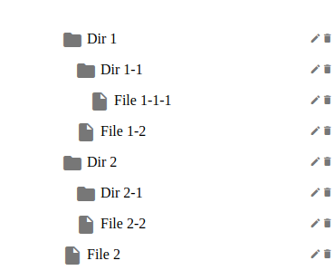

# Тестовое задание на позицию - Frontend developer


 Задача:

  Написать приложение на vue.js (версии 2 или 3) для вывода дерева
  папок и файлов с возможностью редактирования названия и удаления
  элементов. Для хранения состояния использовать vuex (либо
  аналогичный инструмент).

  Начальная структура дерева:


    Dir 1

      Dir 1-1

        File 1-1-1

        File 1-2

    Dir 2

      Dir 2-1

        File 2-2

        File 2

  Примерный вид приложения:

  

  Основные требования:
  - аккуратность, чистота кода
  - комментарии в коде для непонятных участков


DEMO: https://romanskyd.github.io/tree-test-task/


## Project Setup

```sh
npm install
```

### Compile and Hot-Reload for Development

```sh
npm run dev
```

### Compile and Minify for Production

```sh
npm run predeploy
```

